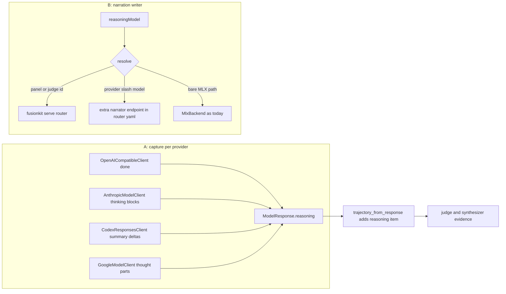

# Reasoning traces: fix gaps and support every provider

Two workstreams: (A) Python engine — capture reasoning from every provider client and stop dropping it before the judge; (B) TypeScript CLI/gateway — let the narration writer (`reasoningModel`) be any configured provider model, not just local MLX.

## A. Python: reasoning across all provider clients

All in [python/fusionkit-core/src/fusionkit_core/clients.py](handoffkit/python/fusionkit-core/src/fusionkit_core/clients.py) unless noted. The two runtime fields already exist (`ModelResponse.reasoning`, `StreamChunk.model_reasoning_delta`); only the OpenAI-compatible client populates them today.

1. **AnthropicModelClient**: in `chat()` collect `thinking` content blocks (skip `redacted_thinking`) into `ModelResponse.reasoning`; in `stream_chat()` yield `content_block_delta` events with `delta.type == "thinking_delta"` as `StreamChunk(model_reasoning_delta=...)`. Capture-when-present only — do not force-enable thinking.
2. **CodexResponsesClient**: in `_stream()` handle `response.reasoning_summary_text.delta` and `response.reasoning_text.delta` events as `model_reasoning_delta`; `chat()` (which folds the stream) accumulates them into `ModelResponse.reasoning`.
3. **GoogleModelClient**: extend `_google_extract` to separate parts with `part.thought == True` into thought text (returned alongside text/tool calls) — this also fixes a latent bug where enabling `include_thoughts` via `extra` would leak thought summaries into the answer `content`. Wire into `chat()` (`reasoning=`) and `stream_chat()` (`model_reasoning_delta=`).
4. **FakeModelClient**: optional `reasoning=` constructor arg so tests can exercise the path.

## B. Python: stop dropping reasoning before the judge

1. **`trajectory_from_response`** in [producers.py](handoffkit/python/fusionkit-core/src/fusionkit_core/producers.py) (the documented single chokepoint): when `response.reasoning` is set, emit `items=[TrajectoryItem(index=0, type="reasoning", text=...)]` with a ~4000-char cap (mirrors the TS `MAX_TEXT`). The judge/synthesizer prompts already render `[reasoning]` items — no prompt changes needed.
2. **`AgentTrajectoryProducer.generate`**: also record `response.reasoning` as a reasoning item ahead of each round's content item.
3. **`_StreamAccumulator`** in [judge.py](handoffkit/python/fusionkit-core/src/fusionkit_core/judge.py): accumulate `model_reasoning_delta` so the folded terminal `ModelResponse` from a streamed synthesizer carries `reasoning` (trace/session parity with the non-stream path).

## C. Python: judge analysis on non-stream fused turns

In `JudgeSynthesizer.fuse()` (non-stream path), prepend `analysis_reasoning_markdown(resolved_analysis, trajectories)` to the terminal response's `reasoning` field (judge markdown first, then any synthesizer model reasoning). [app.py](handoffkit/python/fusionkit-server/src/fusionkit_server/app.py) `_openai_step_response` already serializes `response.reasoning` as `message.reasoning_content`, so the server needs no change. The existing `_judge_unavailable` guard keeps sentinel text off the channel, matching `fuse_stream`.

## D. TypeScript: narration writer for any provider

Today [stack.ts](handoffkit/packages/cli/src/fusion/stack.ts) boots an `MlxBackend` for `reasoningModel` and hard-gates on Apple Silicon. Generalize by resolving the id and routing through the `fusionkit serve` router (which already fronts openai / anthropic incl. `claude-code` / codex / google / openrouter / mlx / openai-compatible):

1. **Resolution order** (new helper in `stack.ts`, applied where the writer is built):
   - Matches a panel/judge endpoint id or model name → point the writer at the router: `new OpenAiBackend({ baseUrl: routerUrl, forceModel: <endpoint id> })`.
   - Parses as `provider/model` (e.g. `openai/gpt-5.5-mini`, `google/gemini-2.5-flash`) → append a `narrator` endpoint to `routerConfigYaml` (cloud endpoints are config-only, no process, so router startup cost is unchanged) and point the writer at the router with that id. Reuse the existing panel-spec provider/keyEnv/baseUrl inference from [env.ts](handoffkit/packages/cli/src/fusion/env.ts).
   - Anything else (bare HF path, e.g. the `DEFAULT_REASONING_MODEL` `mlx-community/Qwen3-1.7B-4bit`) → current MlxBackend boot path; the Apple Silicon gate and background-warm behavior stay for this case only.
2. **narration-writer body hygiene** in [narration-writer.ts](handoffkit/packages/model-gateway/src/frontdoor/narration-writer.ts): make `chat_template_kwargs` opt-in (only the direct-MLX path sets it) so the request body stays clean for cloud providers; `stripThinking` and the sanitize gate already cover reasoning-model replies.
3. **Docs/help text**: update the `reasoningModel` doc comments and `fusionkit config` output ("Local MLX model, Apple Silicon only" → any configured provider model), including [fusion-config.ts](handoffkit/packages/cli/src/fusion-config.ts) and [env.ts](handoffkit/packages/cli/src/fusion/env.ts).

## E. Tests

- Python: provider-client reasoning extraction (Anthropic thinking blocks, Codex summary events, Google thought parts — follow the existing fake-SDK patterns in `tests/test_streaming.py` / `tests/test_core.py`); `trajectory_from_response` reasoning item + cap; non-stream fused response carries `reasoning_content` (extend `tests/test_server.py`); `_StreamAccumulator` accumulation.
- TypeScript: `reasoningModel` resolution (panel-id reuse, `provider/model` → `narrator` router endpoint in the YAML, bare path → MLX), and a narration-writer test asserting the cloud-safe request body.
- Run `uv run pytest tests -q`, `uv run ruff check .`, `uv run pyright`, and `pnpm build && pnpm test` per AGENTS.md.

## Out of scope

- Forcing thinking on for providers where the caller didn't enable it (capture-when-present only).
- The panel-candidate live streams (candidates run non-streaming `chat()`; their reasoning reaches the judge via trajectory items, and the live channel is the narrator's job).